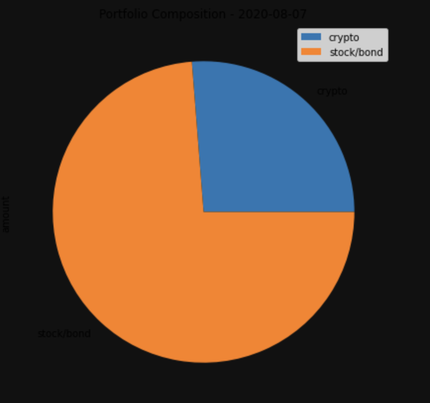
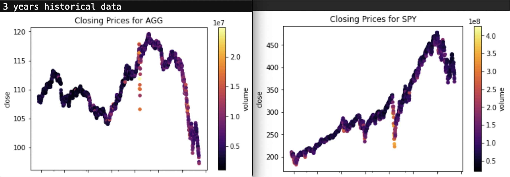
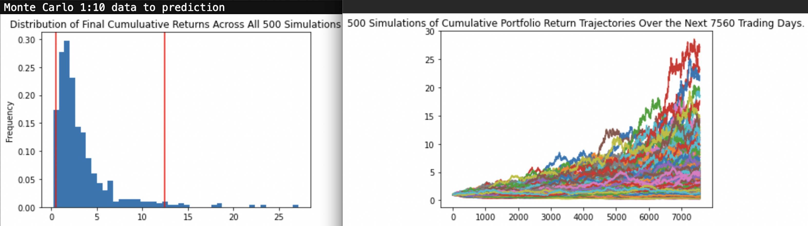
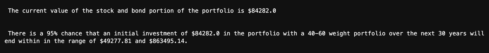
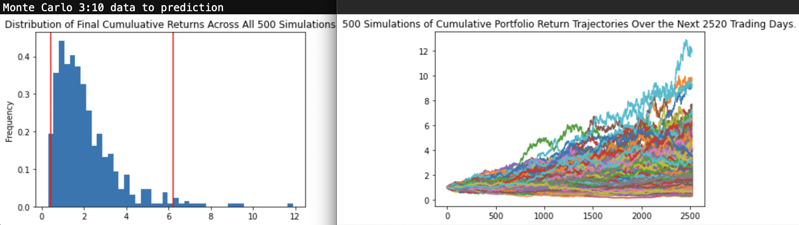
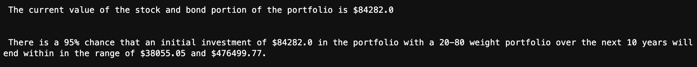
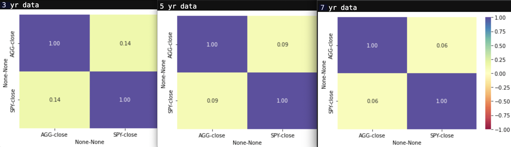

# **Columbia University Engineering, New York FinTech BootCamp** 
# **August 2022 Cohort**
## *Module 5, Challenge - Financial Planning with APIs and Monte Carlo Simulations*

Objective - to simulate local community fintech consulting operations. 
Scenario - contract fullfillment for a large credit union (client/customer) whereby the firm must service the members (users). 
Product - contract entails creation of two financial analysis tools contained within a single Jupyter notebook.

Part 1: A financial planner for emergencies. The members will be able to use this tool to visualize their current savings. The members can then determine if they have enough reserves for an emergency fund.

Part 2: A financial planner for retirement. This tool will forecast the performance of their retirement portfolio in 30 years. To do this, the tool will make an Alpaca API call via the Alpaca SDK to get historical price data for use in Monte Carlo simulations.  Hopefully, enabling reasonable retirement planning forecast based on individual current holdings of cryptocurrencies, stocks, and bonds

This product represents a simplified prototype.  It allows systematic evaluation of current asset holdings (crypto-currencies, stock Funds, and bond funds) to determine present value as well as projected future value.  In addition, it assesses current asset holdings value in relation to projected emergency needs.

---

Supplemental processing and analysis:

Beyond the scope of the assignment, the author sought to conduct additional analysis of the data obtained.  Supplemental and/or extra analysis beyond the scope of the project is noted as 'supplemental' were approrpiate. 

a) While the portfolio presented incorporates the two most widely accepted and recognised cryptocurrencies, it is possible for a portfolio to have dozens, if not hundreds of different cryptocurrency holdings.  Cryptocurrency continues with fraudulent an/or invalid 'coins' in circulation.  As a simple concept application, script was incorprated for exception handling. A simulated 'fraudulent' or invalid cryptocurrency, `Zambookie` was introduced as negative control.  This section of code is added as supplement at end of part 1 in the beginning.

b) to expand analysis and demonstrate further visualization with Monte Carlo simulation adjustments for increasd historical data as compared to extent of future predictions, scatter plots, and heatmap visualization.  

c) to improve granularity the MCForecastTool.py code line 154 was altered changing parameter bin = 10 to bin = 45.  from minor style point, a shorthand was also introduced. 

---

## Note: the market is dynamic.  The dates chosen for this analysis are dynamic.  As such, all figures provided will differ from values returned on any specific day in which this code is operated.  That is to say, figures and values presented herein will be outdated compared to values obtained by user realtime.  All results should be viewed as accurate estimates in relation to the date they are calculated.

---
## **Methods**
### The code script analysis performed:

   The code utilizes API calls to obtain past and present data on asset trade parameters
   Free Crypto API Call - for Bitcoin (BTC) and Etherium (ETH) data
   Alpaca Markets, AlpacaAPI using Alpaca SDK - for SPDR S&P 500 ETF Trust (SPY) and iShares Core US Aggregate Bond ETF (AGG)
    
#### Step I - Financial planner for emergencies; use this tool to visualize current savings.
#### Emergency Financial Planner = present value vs potential emergency needs, i.e. 'emergency fund'

   Given current holdings of Bitcoin and Etherium, 
       obtain current pricing per unit/coin
       calculate total combined value of holdings = combined total cryptocurrency value
       
   Given current holdings of SPDR S&P 500 ETF Trust (SPY) and iShares Core US Aggregate Bond ETF (AGG),
       obtain current pricing per unit/share
       calculate total combined value of holdings = combined total stocks and bonds value 

   Given combined total cryptocurrency value and combined total stocks and bonds value,
       calculate total savings value = total cryptocurrency value + total stocks and bonds value

   Given average current monthly income of credit union member,
       extrapolate emergency fund requirement = 3 x monthly income

   Given:
       combined total stocks and bonds value
       emergency fund requirement
           compare two amounts and determine if,
           a. savings value exceed emergency fund requirement
           b. savings value equals emergency fund requirement
           c. emergency fund requirement exceeds savings value



#### Step II - Financial planner for retirement; forecast retirement portfolio's 30 year performance.
#### use Monte Carlo simulation to analyze past performance of stocks and bonds and simulate future performance to calculate potential future savings/holdings

   30 Year Traditional Planning
   Given current holdings of SPDR S&P 500 ETF Trust (SPY) and iShares Core US Aggregate Bond ETF (AGG),
       Make an API call via the Alpaca SDK to get 3 years of historical closing prices
       use MCForecastTools library to create a Monte Carlo simulation for traditional 60% stocks (SPY) and 40% bonds (AGG) split
       Run Monte Carlo simulation of 500 samples and 30 years for the 60/40 portfolio
       visualize- overlay line plot resulting from a simulation
       visualize- plot probability distribution of the Monte Carlo simulation








   10 Year Growth/'Aggressive' Planning
   Given current holdings of SPDR S&P 500 ETF Trust (SPY) and iShares Core US Aggregate Bond ETF (AGG),
       Make an API call via the Alpaca SDK to get 3 years of historical closing prices
       use MCForecastTools library to create a Monte Carlo simulation for growth 80% stocks (SPY) and 20% bonds (AGG) split
       Run Monte Carlo simulation of 500 samples and 10 years for the 80/20 portfolio
       visualize- overlay line plot resulting from a simulation
       visualize- plot probability distribution of the Monte Carlo simulation







            
   SUPPLEMENTAL and/or EXPANDED ANALYSIS was introduced by the author -
   The historical data was cleaned and analyzed in order to 
       visualize with `plot.scatter` and parameters- x='timestamp', y='close', c='volume' ,
       utilize `pct_change` function in order to calculate daily returns.
   The `corr` function was used to calculate correlations for each fund pair.
   The `heatmap` function from the Seaborn library was used to create a heatmap of correlation values visualization.
   Monte Carlo simulations were also conducted utilizing 5 years of historical closing prices
       Run Monte Carlo simulation of 500 samples and 5 years prediction for the 40/60 portfolio
       visualize- overlay line plot resulting from a simulation
       visualize- plot probability distribution of the Monte Carlo simulation
   Monte Carlo simulations were also conducted utilizing 7 years of historical closing prices
       Run Monte Carlo simulation of 500 samples and 1 year prediction for the 40/60 portfolio
       visualize- overlay line plot resulting from a simulation
       visualize- plot probability distribution of the Monte Carlo simulation
   
    
   
   Additional information about the heatmap method from seaborn on the [documentation page](https://seaborn.pydata.org/generated/seaborn.heatmap.html#seaborn.heatmap).


---
## **Technologies**
---
### **Dependencies**

This project leverages Jupyter Lab v3.4.4 and python v3.7 with the following packages:

* [os](https://docs.python.org/3/library/os.html) - provides a portable way of using operating system dependent functionality.

* [getenv](https://docs.python.org/3/library/os.html?highlight=os%20getenv#os.getenv) - From 'os', return the value of the environment variable key if it exists, or default if it doesn’t.

* [requests](https://requests.readthedocs.io/en/latest/) - an elegant and simple HTTP library for Python, allows you to send HTTP/1.1 requests extremely easily.

* [json](https://docs.python.org/3/library/json.html?highlight=json) - JavaScript Object Notation, is a lightweight data interchange format inspired by JavaScript object literal syntax 

* [pandas](https://pandas.pydata.org/docs/) - Software library written for the python programming language for data manipulation and analysis.

* [Timestamp](https://pandas.pydata.org/docs/reference/api/pandas.Timestamp.html) - From 'pandas', equivalent of python’s Datetime, used for the entries that make up a DatetimeIndex, and other timeseries oriented data structures in pandas.

* [concat](https://pandas.pydata.org/docs/reference/api/pandas.concat.html) - From 'pandas', concatenate pandas objects along a particular axis, allows optional set logic along the other axes.

* [Dataframe](https://pandas.pydata.org/docs/reference/api/pandas.DataFrame.html) - From 'pandas', data structure also contains labeled axes (rows and columns). Arithmetic operations align on both row and column labels. Can be thought of as a dict-like container for Series objects. The primary pandas data structure.

* [numpy](https://numpy.org/doc/stable/) - Software library, NumPy is the fundamental package for scientific computing in Python, provides vast functionality.

* [timedelta](https://numpy.org/doc/stable/reference/arrays.datetime.html) - From 'NumPy', from datetime, allows the subtraction of two datetime values, an operation which produces a number with a time unit.

* [dot_env](https://pypi.org/project/python-dotenv/) - Python-dotenv reads key-value pairs from a .env file and can set them as environment variables.

* [alpaca-trade-api](https://pypi.org/project/alpaca-trade-api/0.29/) - a python library for the Alpaca trade API. It allows rapid trading algo development easily, with support for the both REST and streaming interfaces.

* [MCForecastTools]- a python library for the Monte Carlo simulation framework, exists as a file named MCForecastTools.py, in the same folder as the challenge notebook. This file contains all the logic, in the form of Python code, required to run the Monte Carlo simulation on portfolio price data.

For additional and / or supplemental processing and visulaization this project also makes use of the following packages:

* [matplotlib.pyplot](https://matplotlib.org/stable/tutorials/introductory/pyplot.html) - Matplotlib is a comprehensive library for creating static, animated, and interactive visualizations in Python; matplotlib.pyplot is a collection of functions that make matplotlib work like MATLAB.

* [seaborn](https://seaborn.pydata.org/tutorial/introduction) - Software library for making statistical graphics in Python. It builds on top of matplotlib and integrates closely with pandas data structures.


### **Hardware used for development**

MacBook Pro (16-inch, 2021)

    Chip Appple M1 Max
    macOS Monterey version 12.5.1

### **Development Software**

Homebrew 3.5.10

    Homebrew/homebrew-core (git revision 0b6b6d9004e; last commit 2022-08-30)
    Homebrew/homebrew-cask (git revision 63ae652861; last commit 2022-08-30)

anaconda Command line client 1.10.0

    conda 4.13.0
    Python 3.7.13

pip 22.1.2 from /opt/anaconda3/envs/dev/lib/python3.7/site-packages/pip (python 3.7)


git version 2.37.2

---
## *Installation of application (i.e. github clone)*

 In the terminal, navigate to directory where you want to install this application from the repository and enter the following command

```python
git clone git@github.com:Billie-LS/Emergency_and_Retirement_Financial_Planner.git
```

---
## **Usage**

**Known Issues**
This script utlizes a `timedelta` operation to base calculations on most recent 'yesterday' date.  Therefore, running this tool on Sunday or Monday will produce an error as there will be no market data for Saturdays or Sundays.  For the purpose of pending review, `yesterday = today - timedelta(days = 2)`

From terminal, the installed application is run through jupyter lab web-based interactive development environment (IDE) interface by typing at prompt:

```python
  > jupyter lab
```

---
## **Project requirements**
### see starter code

---
## **Version control**

Version control can be reviewed at:

```python
https://github.com/Billie-LS/Emergency_and_Retirement_Financial_Planner
```

[repository](https://github.com/Billie-LS/Emergency_and_Retirement_Financial_Planner)


---
## **Contributors**

### **Author**

Loki 'billie' Skylizard
    [LinkedIn](https://www.linkedin.com/in/l-s-6a0316244)
    [@GitHub](https://github.com/Billie-LS)


### **BootCamp lead instructor**

Vinicio De Sola
    [LinkedIn](https://www.linkedin.com/in/vinicio-desola-jr86/)
    [@GitHub](https://github.com/penpen86)


### **BootCamp teaching assistant**

Santiago Pedemonte
    [LinkedIn](https://www.linkedin.com/in/s-pedemonte/)
    [@GitHub](https://github.com/Santiago-Pedemonte)


### **askBCS assistants**

Vijaya Reddy
    [LinkedIn](https://www.linkedin.com/in/vijaya-reddy-209b041a3/)

Mounika Mamindla
    [LinkedIn](https://www.linkedin.com/in/mounika-mamindla/)

Mohamed Metwalli
    [LinkedIn](https://www.linkedin.com/in/mmetwalli/)
    [@GitHub](https://github.com/mmetwalli96)


### **GitHub inspiration - dynamic and/or current date formatting ideas**


endie5 
    [@GitHub](https://github.com/endie5/Challenge5)


### **Additional references**


[SparkByExamples.com](https://sparkbyexamples.com/pandas/pandas-drop-a-level-from-a-multi-level-column-index/)

[W3Schools](https://www.w3schools.com/python/python_dictionaries.asp)

[Geeks for Geeks](https://www.geeksforgeeks.org/get-yesterdays-date-using-python/)

[pandas.to_datetime documentation](https://pandas.pydata.org/docs/reference/api/pandas.to_datetime.html)

[Numpy Datetimes and Timedeltas](https://numpy.org/doc/stable/reference/arrays.datetime.html)

---
## **License**

MIT License

Copyright (c) [2022] [Loki 'billie' Skylizard]

Permission is hereby granted, free of charge, to any person obtaining a copy
of this software and associated documentation files (the "Software"), to deal
in the Software without restriction, including without limitation the rights
to use, copy, modify, merge, publish, distribute, sublicense, and/or sell
copies of the Software, and to permit persons to whom the Software is
furnished to do so, subject to the following conditions:

The above copyright notice and this permission notice shall be included in all
copies or substantial portions of the Software.

THE SOFTWARE IS PROVIDED "AS IS", WITHOUT WARRANTY OF ANY KIND, EXPRESS OR
IMPLIED, INCLUDING BUT NOT LIMITED TO THE WARRANTIES OF MERCHANTABILITY,
FITNESS FOR A PARTICULAR PURPOSE AND NONINFRINGEMENT. IN NO EVENT SHALL THE
AUTHORS OR COPYRIGHT HOLDERS BE LIABLE FOR ANY CLAIM, DAMAGES OR OTHER
LIABILITY, WHETHER IN AN ACTION OF CONTRACT, TORT OR OTHERWISE, ARISING FROM,
OUT OF OR IN CONNECTION WITH THE SOFTWARE OR THE USE OR OTHER DEALINGS IN THE
SOFTWARE.


